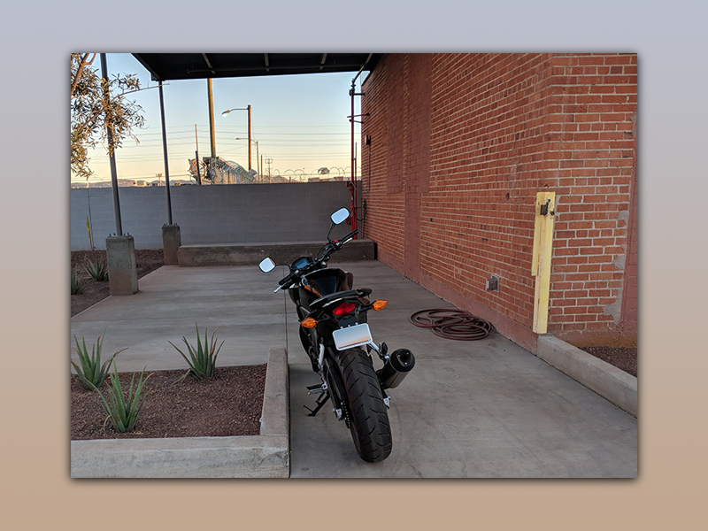

# Introduction



## Emily
- **Software engineer** working for a team called [Privoro](privoro.com)
   - **Objective**
        To make mobile devices private by hardening the security of the device on the hardware level
- **Speaker at ISACA**
    Being concerned about information security is a significant aspect of my job and experience
    Data privacy is a concern of mine *in general*
    - **Objective**
        Impart why information security and privacy should be a concern of everyone working with software today
        Share and discuss experiences in order to encourage people to enter the software industry with a strong background in information security
- **Martian colonist**
    An ideal, highly-coveted career title

- **Academic**
  - **Objective**
        *Get qualifications required to work for NASA*
  -  Acquired Degree in **May 2016**
     -  Computer science B.S.
     -  Northern Arizona University

- **Programmer**
  - Since 2014
  - **Objective**
        Reduce collective reliance on human time and energy
        Recruit for and promote *the agenda* (exploration, automation)
  - *Specializations*
        Cloud
        Web
        User interface

```
I worked for NASA in an official capacity for three months in 2014, then worked for the United States Geological Survey Astrogeology department in Flagstaff for two years as a web developer. 99% of the funding for the Astrogeology department came from NASA during that time.

Lately, I've been developing user interfaces and cloud native utilties for start ups in Phoenix.

💻I have hobbies, too. I mostly code and write for fun, but when I'm not at the computer I enjoy driving. I have three motorcycles. 🏍🏍🏍
```

## Path & Credentials

| year | experience |  |
| - | - | - |
| 2010-16 | Nortern Arizona University | *Student* <br/> 10-11 *Physics/Astronomy*<br/>11-12 *Mathematics*<br/>12-13 *Economics/Accounting*<br/>13-16 **Computer Science**
| 2014 | Programmer | *Internship*<br/>**NASA** |
| 2014-16 | Grader / Lab Aide / Lecturer | *Work*<br/>**Northern Arizona University** |
| 2014-16 | Web Developer | *Work*<br/>**United States Geological Survey** |
| 2016-17 | Software Engineer | *Work*<br/>**Sweetbridge** |
| 2017-2018 | Software Engineer | *Work*<br/>**Privoro** |


### Degree & University

- Engineer (software)
  - Computer engineering
  - **Computer science**
  - Electrical engineering
  - Mechanical engineering
  - Aerospace engineering
  - Cyber security
  - ...
- Scientist (programmer)
  - Mathematics
  - Informatics
  - Physics
  - Biology

```
University degrees as credentials
---------------------------------

I put a special emphasis on engineering degrees because while many university degrees serve as signals that you can sit still for a long periods, schedule appointments & manage your time, regularly complete projects before predetermined deadlines, and have invested a significant amount of time and money in order to indicate your employability, they often do not serve their purported purpose of becoming a more educated, skilled individual. It is important to weigh what you expect to get out of the university experience against the objective reality of the cost associated with obtaining a degree.

The work involved to obtain a degree in engineering will typically involve the practice of more practical, on-the-job skills. A degree in computer science, for example, will require you to develop specific programming skills, demonstrate a generalized mathematical problem-solving ability, and most importantly, expose you to all the different subsets of software engineering, such as web development, which helps to focus your career search, and engineering processes, which will be relevant to most engineering jobs.

If you don't have the resources or time to get an engineering degree, you can still become a successful software engineer. In fact, you can learn everything I know for free on the web. However, you may be at a disadvantage in terms of pay and the types of employers that ask you to come in for an interview (until you gain the relevant experience).

Additionally, If you want to work on safety-critical systems, such as those common in aerospace and systems that serve the Department of Defense, a bachelor's degree in engineering is most likley going to be the minimum requirement.
```

### Workplace

* 2019 Stack Overflow Developer Survey
    - [Most software developers think they are above-average](https://insights.stackoverflow.com/survey/2019#developer-profile-_-all-of-the-developers-are-above-average)
    - [Women feel disproportionately less competent.](https://insights.stackoverflow.com/survey/2019#developer-profile-_-feelings-of-competence-by-gender)
    - Typically attributed to [imposter syndrome](https://en.wikipedia.org/wiki/Impostor_syndrome).

```
Searching for a career
-----------------------

Brave New World
---------------

Careers in IT/Information Security are plentiful and lucrative. This has created a new and competitive market that includes recruiters who are themselves incentivized to pair you with employers. I suspect the most productive ones use **ALGORITHMS** to find people to recruit. That is, they are assisted in a big way by software that leverages one or a combination of data indexing, tagging systems, query processing, aggregators, etc.

Think of how you search for videos to watch on youtube, or how you find articles to include in a research paper. You might run a search for videos of "guilty dogs" and get a bunch of good hits, indeed these are dogs and they do look awfully guilty. It doesn't mean you're going to get the cutest, guiltiest-looking dog. You might get a bunch of posts of people "pet-shaming" their dogs, which is sort of related, but, some of those dogs look straight-up smug and that's not really what you were searching for. It's not a perfect system, but it has significantly streamlined the process of *discovery*.

This incentivises a type of behavior I can't personally recommend though I have benefitted greatly from the practice--which is people thinking like computers. I've seen engineers fill their resumes up with "keywords" because they assume popular recruiting tools parse words like "DevOps", "Splunk", "AWS", "Javascript", etc., and index the data that is associated with you under these as "categories" or "tags" that makes it easy for recruiters and employers to find and contact potential employees for specific positions. Some tools, like LinkedIn, actually encourage this behavior by giving you cute little buttons that are irresistable to press, begging you to add skill after obscure skill, so that it will be more likely that your data will appear in some search results. "Appearing in searches" is a metric LinkedIn will commonly notify you about, because that is purportedly the experience LinkedIn is trying to give you the impression of--that your use of it is making you measurably more employable. The idea being, the more closely your data matches the query, the higher up you'll be on the list.

Being human
-----------

I imagine it's quite convenient and certainly this kind of technology has been used to great success, but I find it encourages people to try to game the system and write unintelligible resumes that were not meant to be read by human eyes but instead ingested by a machine.

I say this, because other engineers are often the "gatekeepers", and they will look at your resumes and judge you mostly for your communication skills during your initiation ritual--or, interview process. I've been one of those engineers. I get enough one-on-one time with computers and would prefer it if people did not imitate them.

That said, I'm not trying to discourage anyone from using the web to find jobs and careers that suit you. It's the most powerful, widely used method of recruiting, but you should understand how it works, without disqualifying yourself because you didn't foster communication with the human beings that are responsible for hiring you.
```

# Why Information Security

> I didn't choose the thug life, the thug life chose me.
    - Tupac Shakur

- 143 million  Americans' personally identifiable information was [stolen from one of the largest credit services in the world, because the login credentials for critical systems was username: "admin" password: "admin"](https://www.cnbc.com/2017/09/14/equifax-used-admin-for-the-login-and-password-of-a-non-us-database.html).
- [There are consequences for the employer.](https://www.housingwire.com/articles/48267-equifax-expecting-punishment-from-cfpb-and-ftc-over-massive-data-breach)
- [Record spending on information security](https://www.statista.com/chart/15198/estimated-worldwide-spending-on-information-security/)
- `Can't escape.`

```
After graduating, a new engineer will likely be exposed to many different kinds of career opportunities, but because of the need for deep and effective *domain knowledge*, engineers usually focus on some subset of software engineering. All software engineering fields have requirements related to "information security".
```

| Domain | |
| -- | -- |
| Aerospace | keeping trade secrets secret, having clearance requirements, espianoge mitigation
| Embedded systems | hardware security and availability, sabotage prevention, human user safety |
| Telecommunications / Web Technology | database security, data encryption, device-to-device communications |
| Cloud / Distributed systems | role-based access control, design and enforcement of administrative policies |
| Native app development | knowledge of operating system vulnerabilities |
| Machine Learning / Artificial Intelligence / "Big Data" | collection and display of personally identifiable information<br/>perhaps eventually, the currently underdeveloped security practices surrounding generalized artificial intelligence |
| Entertainment / Marketing / Advertising | Privacy, enforcement of contractual agreements, tracking policies, data collection |


## On the job (Cloud Engineer)
  - Access control
  - Provisioning credentials
  - Physical/device security
  - Encryption of sensitive data
  - Assured identity
  - **Objective**
    To provide a secure interface for managing data
    To ensure the privacy of data, prevent legal action as a result of a security breach
    To maintain trust through polished implementation and good policies
    To promote *the agenda*


```
Personal Responsibility
-----------------------

The purported security of any software-based solution usually comes down to personal choices and day-to-day decisions I make as part of a larger engineering team.

The quality of these decisions depends entirely on mhy knowledge, experience, wisdom and whimsy.

Because of the vareity in wisdom and experience between humans, engineers typically rely on written policies related to security, identity, and information assurance for how to handle things like sensitive data

ROI
---

As software engineer, your success as an employee is often measured using metrics presented in terms of value delivered to the customer.

Thought about this way: The engineer makes software that ideally works and takes measurements along the way about how long it took to make each feature of the software. Some version of the software is delivered to the customer, who pays for it. From this information, the engineer may produce positive metrics that demonstrate how much value the employer can claim was produced by that particular software. That value ultimately has to outweigh the cost of the engineer's payroll to have an acceptable "return on investment".

As we've seen, a security professional can "get away" without implementing any best practices for as long as it takes for a security breach to occur. In the best case, this costs the company a lot of money and nobody goes to jail. In the worst case, the company arbitrarily sacrifices their technical professionals. This is a purely social ritual, which makes no rational sense, and is a consequence of an incorrect interpretation of acquiring justice for those who were wronged.

It's not uncommon for employers to forgo security for velocity, especially in the case of small businesses and startups. While there are now some regulations to using software to track individuals without their consent, or to store their private data in a non-secure way, that doesn't mean that's the common practice or that it will be expected of you. It especially will not be enumerated in clear, certain terms.

Personally, I think if you want to develop software, and develop software well, you have an ethical obligation to protect your users and their data.
```

# Vital Skills

| 🔑 | Education | Knowledge | Skills |
| -- | -- | -- | -- |
| | Discrete mathematics | Sets, statements of logic, graphs, & statistics. | Problem solving & showing work |
| | Data Structures | Puts tools in your tool box: infamous algorithms, development patterns, & vocabulary | How to break problems down and solve them with code. |
| | Intelligent systems & game theory | How do *people* make decisions? How do `computers` make decisions? | More problem solving. Dealing with complexity |
| | Art, Design & User Experience (UX) | The intrinsic value of aesthetics and design. | Modeling, planning, elucidating requirements, non-verbal communication, and testing. |
| | Psychology / Neuroscience | What is the difference between what people say they want and what they actually want?<br/> (Human) Social behavior vs. rational behavior. | How to read human minds.<br/> Empathy.<br/> |
| | Ethics & Philosophy | What's "good" anyway"? What makes it "better"? | Personal responsibility, logic, forming arugments.
| | Software Architecture | Software in context. | Planning, documentation,  working effectively with abstractions. |
| | Web development / Distributed systems | Domain knowledge.


## Success in OZ

**Scarecrow**  🧠 - Mind

- Wisdom vs Ignorance
- Acceptance and recognition of reality
- Ability to be objective


**Lion**  🎖 -  Courage

>The only time a man can be brave is when he is afraid.
    - Eddard Stark

- Transparency in communication
- A sense of fairness, justice
- Willingness to stand up for your principles

**Tin Man** - Heart

- Lovingkindness
- People have different capacities for empathy.
- `"low empathy" !==  "low emotional intelligence"`


**Dorothy** - Home

>"Rule 7: Pursue what is Meaningful, not what is Expedient"
    - Jordan Peterson

- `"self-love" !== "self-enhancement"`
- [People who have strong, positive relationships live longer, report more often a sense of well-being and fulfillment](https://www.health.harvard.edu/newsletter_article/the-health-benefits-of-strong-relationships)

4.	What advice would you give an earlier you?  What do you wish you had known?

*What would you do differently*?

I had a lot of opportunities to reflect on my experiences while preparing for this event and found few retrospection


>Why don't you just drop your cynicism and your paranoia and your defeat? You know, just because it's positive and good doesn't make it silly or trite!
      - Melissa Scully

```
Staying alive
-------------

While I often struggle with the idea that I exist at all, since I am still alive, that's why I "keep going".


```

# Network
**[Privoro is hiring!](privoro.com)**


